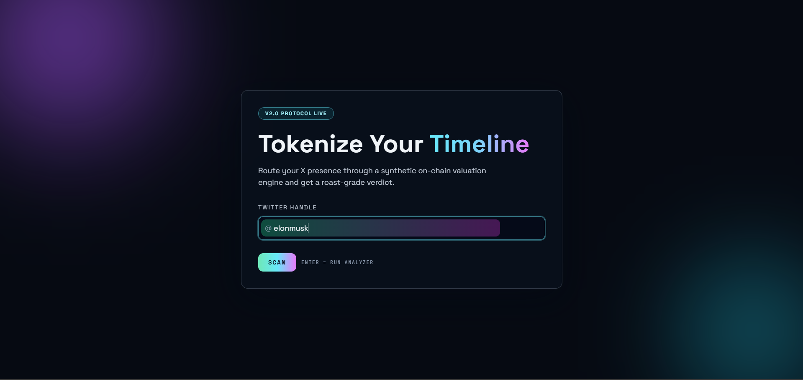
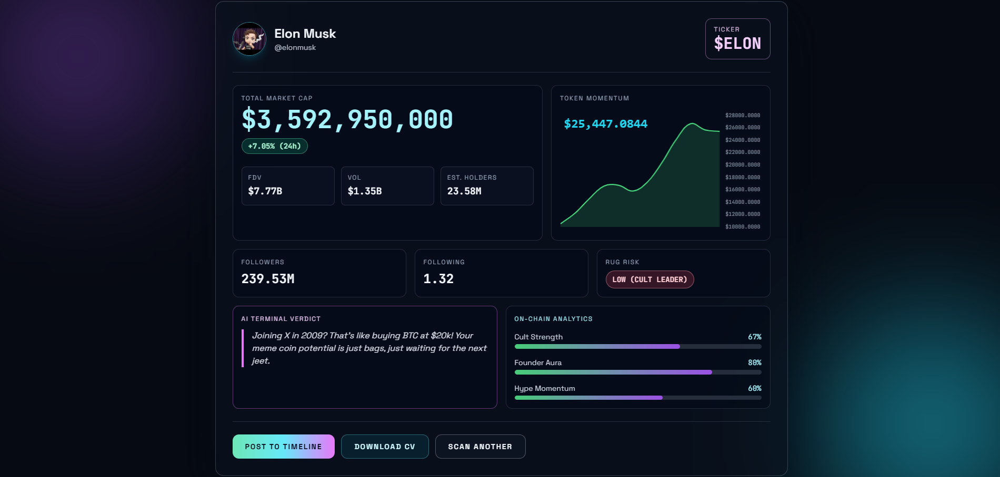

# 🚀 Twitter Profile Analyzer

A high-performance web application that fetches real-time data from X (Twitter) using the RapidAPI Enterprise engine and generates AI-powered insights using OpenAI's GPT-4o-mini.
## 📸 Screenshots

## ✨ Features

* **Real-time Data:** Fetches profile details, follower counts, and bio directly via RapidAPI.
* **AI Analysis:** Uses OpenAI to generate professional summaries and "verdicts" based on profile data.
* **Modern UI:** Clean, terminal-style interface for a sleek developer look.
* **Secure:** Environment variable management for API keys.
* **Lightweight:** Built with Node.js and Express for maximum speed.

## 🛠 Tech Stack

* **Backend:** Node.js, Express.js
* **APIs:** RapidAPI (Twitter V1.1 Enterprise), OpenAI (GPT-4o-mini)
* **HTTP Client:** Axios
* **Environment:** Dotenv for secure configuration

## 🚀 Getting Started

### Prerequisites

* Node.js v18 or higher
* A RapidAPI Key (Subscribed to Twitter Api V1.1 Enterprise)
* An OpenAI API Key

### Installation

1. Clone the repository:
~~~~bash
git clone [https://github.com/sent1o/twitter-landing.git](https://github.com/sent1o/twitter-landing.git)
cd twitter-landing
~~~~

2. Install dependencies:
~~~~bash
npm install
~~~~

3. Create a `.env` file in the root directory and add your credentials:
~~~~env
RAPIDAPI_KEY=your_rapidapi_key_here
OPENAI_API_KEY=your_openai_key_here
PORT=3000
~~~~

4. Start the server:
~~~~bash
node server.js
~~~~

5. Open your browser and navigate to `http://localhost:3000`